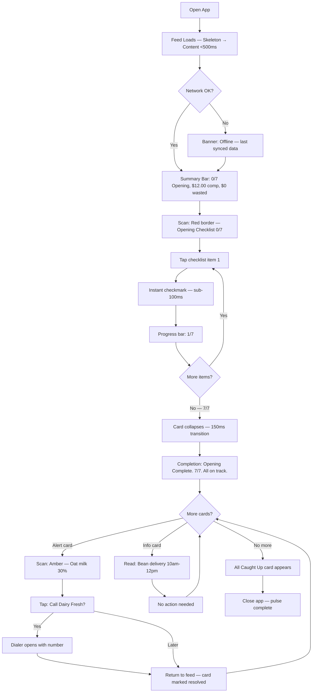
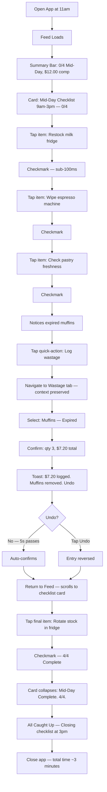
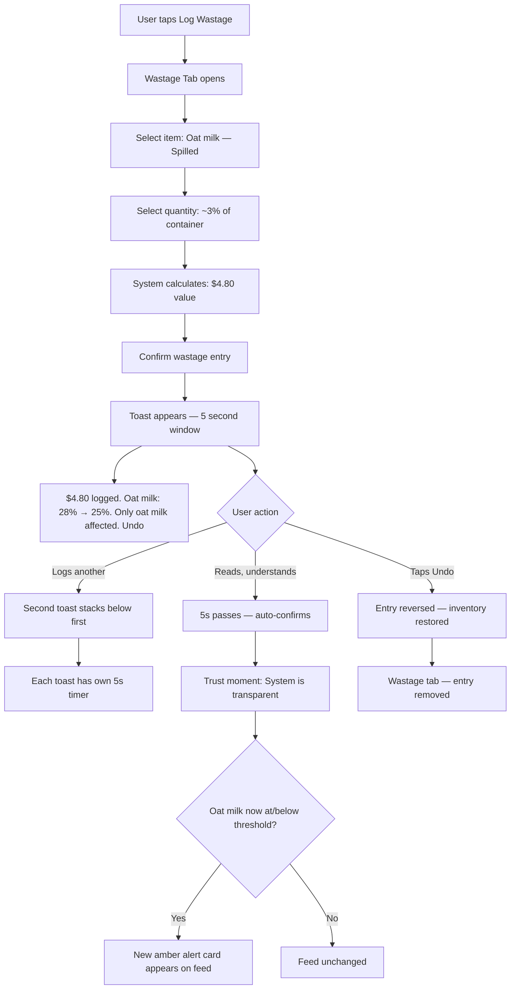
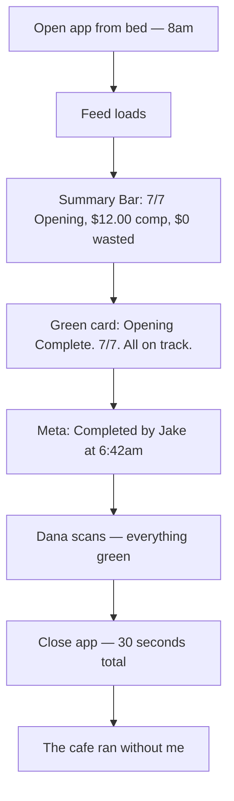
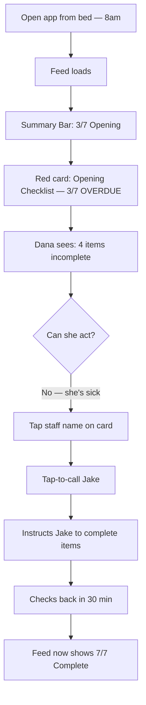
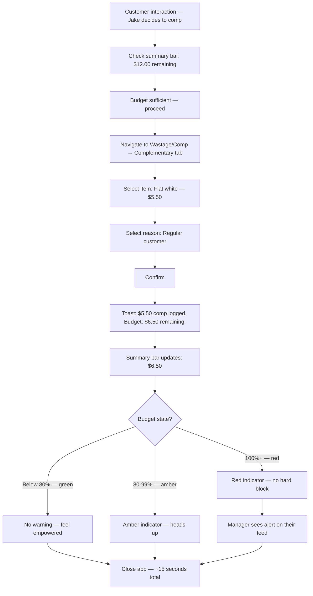
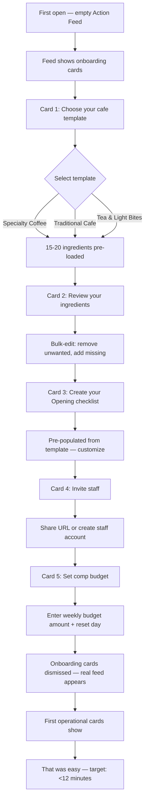
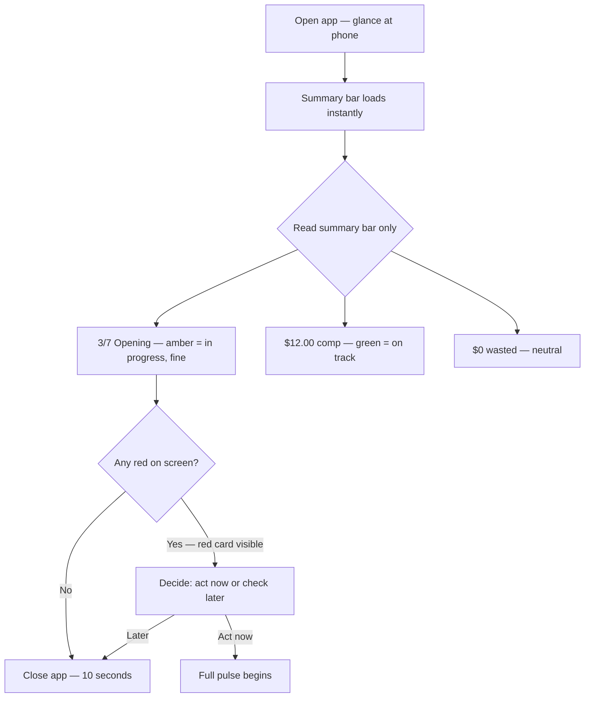
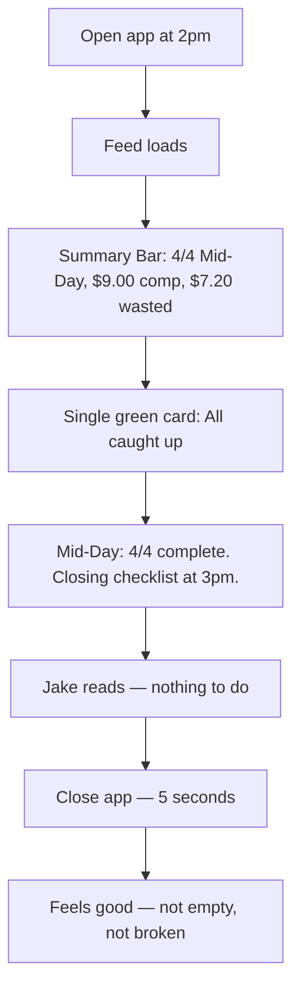
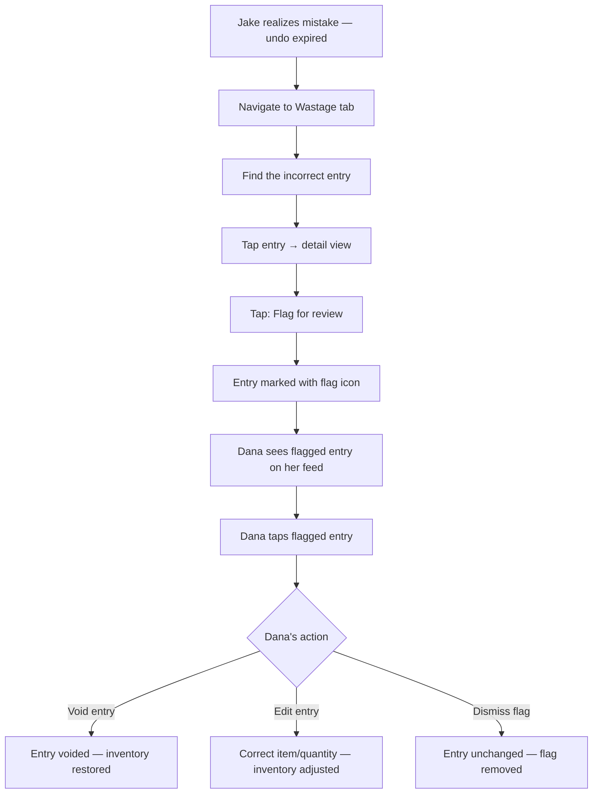

# UX Design Specification cafe mgmt

**Author:** Base
**Date:** 2026-03-06

---

<!-- UX design content will be appended sequentially through collaborative workflow steps -->

## Executive Summary

### Project Vision

Cafe mgmt replaces notebooks, spreadsheets, and memory with a proactive operational assistant designed for one-handed use during active cafe operations. Four screens (Action Feed, Inventory, Wastage/Comp, Operations) connect into a single operational loop where every event carries a dollar value. The UX must deliver consumer-app simplicity with industrial-grade operational reliability.

### Target Users

**Dana (Manager/Owner, 34):** Opens the app before dawn, works through a structured morning in under 10 minutes. Needs oversight without being present — can check operations from bed when sick. Low tolerance for setup friction. Configures checklists, ingredients, budgets, and staff accounts.

**Jake (Staff/Barista, 22):** Opens the app at shift start, sees exactly what to do. Logs wastage and comps in 2 taps, spends under 3 minutes total in-app per shift. Must feel like a helpful tool, not a tracker. Never needs to navigate beyond Action Feed and Wastage/Comp.

### Key Design Challenges

1. **One-handed, interruptible interactions** — Users are always multitasking. Every flow must survive interruption, browser close, and resume without data loss. No multi-step wizards.
2. **Custom slider precision** — Inventory slider must be 60fps, precise on 320px-wide screens, with configurable snap increments per ingredient. Slider must feel heavy with snap resistance to prevent accidental changes. Highest-risk custom component.
3. **Trust through transparency** — Connected operations (wastage to inventory auto-deduct) must show visible confirmation with undo. Opaque automation destroys trust.
4. **Role-based simplicity** — Same app, two depth levels. Staff see a simplified view without feeling locked out. Manager sees full control without overwhelming Staff's experience.
5. **Zero-training onboarding** — Template selection + progressive Action Feed cards. No documentation, no walkthrough videos. The app teaches itself through use.
6. **Glanceability** — The app is scanned at arm's length as often as it's tapped. Large numbers, high contrast, status colors must be readable without picking up the phone.
7. **Attention fragmentation** — Users have 3-second attention windows between tasks. Every screen must communicate its most important information instantly. No scrolling required to understand current state.

### Design Opportunities

1. **Action Feed as primary interface** — Most users should rarely leave this screen. Every alert resolves with one tap. The feed IS the product for staff users.
2. **Dollar visibility as differentiator** — Every event shows its cost. This creates the "aha moment" — seeing $47 in wasted oat milk this week changes behavior.
3. **Comp budget as empowerment** — Staff see remaining budget and make autonomous decisions. This reframes tracking as enablement.
4. **Onboarding through the product itself** — Onboarding cards appear on the Action Feed. Users learn by doing, not reading. Setup feels like customizing, not configuring.
5. **Hub-and-spoke navigation** — Action Feed is the hub where 80% of interactions happen. Other screens are spokes entered from feed context and returned to feed after. Minimize navigation, maximize feed utility.
6. **"All clear" as a rewarding state** — An empty Action Feed should feel satisfying and reassuring ("Everything's handled"), not empty or broken.
7. **Trend indicators** — Dollar values gain meaning with week-over-week arrows. Turns data into insight within existing FRs.

### Design Philosophy

- **Input strategy:** Hybrid slider/stepper — slider for percentage-based items (milk levels), stepper for discrete counts (bags, cases). Slider must feel heavy with snap resistance.
- **Error UX:** Calm, helpful, actionable. Errors state what happened + one action to fix it. No alarm, no jargon.
- **Color vocabulary:** Green = good/complete. Amber = warning/attention. Red = urgent/overdue. Blue = informational. Gray = inactive/done.
- **Animation:** Functional transitions only (<200ms). Indicate state changes (card collapse, item complete). Respect prefers-reduced-motion. No decorative animation.
- **Typography:** Large bold for dollar values and key numbers. Medium for labels and card titles. Small for timestamps and metadata.
- **Session behavior:** Data persists immediately on interaction (optimistic UI). UI state (scroll position) resets on return. Checklist progress persists.

### UX Patterns

- **Action Feed layout:** Fixed summary bar (comp budget, checklist progress) + scrollable card area
- **Checklist visual chunking:** Category headers within long checklists for scannability
- **Quick-action links:** Checklist items can launch pre-filtered navigation to related screens (e.g., "Log wastage" opens Wastage tab with context)
- **Staff "flag for review":** Staff can mark logged events for manager correction without void permissions

## Core User Experience

### Defining Experience

**Core Loop — The Pulse:** Open → Scan → Act → Done. This is a 10-60 second micro-session that repeats throughout the day — not a single work session. Dana pulses at 5:55am (morning routine), 8am (mid-rush check), noon (check Jake's progress), 2pm (sick day oversight). Jake pulses at 11am (shift start), 1pm (log wastage), 3pm (closing checklist). Design for the pulse, not the session.

**The ONE thing users do most frequently:** Complete a checklist item. Tap → checkmark → next item. This is the atomic interaction that defines the product's rhythm.

**The critical action to get right:** The Action Feed morning open. In 2 seconds, the user understands: what needs doing, what's urgent, and what's fine. The feed communicates state before the user consciously reads — through color, position, and visual weight. The feed is a **state display** (awareness dashboard), not a task list (obligation).

### Platform Strategy

| Decision | Choice | Rationale |
|----------|--------|-----------|
| Platform | Mobile-first web (PWA-ready) | No app store friction. URL share for staff onboarding. |
| Primary input | Touch (one-handed, thumb-zone) | Users hold phone in one hand while working |
| Offline | Online-required for MVP | Phase 2 adds offline caching |
| Device capabilities | Phone dialer (tel: links) | Supplier tap-to-call only |

**Thumb zone design:** All primary actions (checklist tap, wastage log, feed card tap) within natural thumb arc. Bottom navigation. Cards start mid-screen. Confirm buttons in lower half.

### Effortless Interactions

| Interaction | Target Effort | How |
|------------|--------------|-----|
| Complete checklist item | 1 tap | Tap item → instant checkmark + timestamp |
| Undo checklist completion | 1 tap | Tap completed item → unchecks |
| Log wastage | 2 taps | Quick-log preset → confirm item |
| Log comp | 2 taps | Select item → confirm with reason |
| Confirm unchanged inventory | 1 tap per item | Pre-filled value → tap to confirm |
| Resolve alert | 1 tap | "Call supplier? [Yes]" → dialer opens |
| View comp budget remaining | 0 taps | Visible in fixed summary bar |
| Know what to do next | 0 taps | Feed auto-selects time-appropriate checklist |
| Switch checklist period | 1 tap | Tap period label → switches |
| Undo wastage entry | 1 tap | Tap undo in confirmation toast (5s window) |

**Eliminated steps vs competitors:** No data entry for inventory (pre-fill + confirm). No searching for supplier numbers (tap-to-call from card). No calculating costs (dollar values auto-attributed). No asking "what should I do" (feed tells you).

### Critical Success Moments

1. **Dana's first morning open** — Sees 3 clear cards, knows it's a 7-minute morning. Works through everything. Feed goes calm. *"This is better."* Failure: slow load, confusing layout, unclear priorities → back to notebook.

2. **Jake's first shift start** — Sees his checklist with time-range label ("Mid-Day 9am-3pm"). No questions needed. Taps through items, logs wastage on expired stock. 3 minutes total. *"This actually helps."* Failure: wrong checklist auto-selected, feels like surveillance → stops using.

3. **First auto-deduct** — User logs wastage. Confirmation shows: "Oat milk: 28% → 25%. Only oat milk deducted. Undo?" The system is transparent and connected. *"It's smart."* Failure: opaque, no undo, unclear what was affected → trust dies.

4. **Dana checks from bed** — Opens app, sees: "Opening: Complete. 7/7 items by Jake at 6:42am." Wastage logged. Comp budget on track. *"The cafe ran without me."* Failure: can't see what happened at a glance → oversight promise fails.

5. **Jake's first comp** — Logs a flat white for a regular. Sees: "$5.50 logged. Budget: $6.50 remaining." Feels empowered, not surveilled. *"I can make this call myself."* Failure: feels like being tracked, budget feels like a limit → resentment.

6. **Onboarding complete** — Dana selects template, uses bulk-edit to remove unwanted ingredients, customizes 20%. 12 minutes. Feed shows real operational cards. *"That was easy."* Failure: setup >15 minutes, feels like form-filling → abandons.

### Experience Principles

1. **Trust Through Visibility** — Every automated action shows what it did, what it affected, and offers undo. Nothing happens behind the user's back. Explicit deduction scope in confirmations.
2. **Scan, Don't Read** — Every screen communicates state through color, size, and position in under 3 seconds. Design for micro-session pulses, not full work sessions.
3. **Show the Money** — Dollar values always visible on every event. Visually dominant where cost is the primary insight (wastage log, comp log, weekly totals). Present but secondary where status is primary (feed cards, inventory levels).
4. **Routine = Effortless, Consequential = Deliberate** — Checklist taps, inventory confirms, wastage presets: one tap, zero friction. Voiding entries, changing budgets, deleting items: confirmation required. Two tiers of interaction weight.
5. **Silence = Success (with confirmation)** — Empty feed and complete checklists are positive states. Show explicit completion summary ("Opening: Complete. 7/7 items. All on track.") so calm feels earned, not empty.

### Screen Transitions & Information Density

**Navigation:** Bottom nav with 4 tabs (Action Feed, Inventory, Wastage/Comp, Operations). Contextual links from Action Feed cards navigate to relevant screens. Back = return to feed.

**Information density limits:**

| Screen | Max Visible Before Scroll | Grouping Strategy |
|--------|--------------------------|-------------------|
| Action Feed | 5 cards | Priority hierarchy, no grouping |
| Inventory | 8-10 items | Group by category, pinned items at top |
| Wastage log | 10 entries | Reverse chronological |
| Checklists | 8 items recommended | Visual chunking with category headers |

**Swipe behavior:** No destructive swipes. Swipe gestures reserved for non-destructive actions only (e.g., horizontal scroll between checklist periods). All destructive actions require tap + confirmation.

## Desired Emotional Response

### Primary Emotional Goals

| User | Primary Emotion | What Triggers It |
|------|----------------|-----------------|
| Dana | **Trust** — "The app holds the cafe's knowledge" | Seeing completed checklists, accurate inventory, visible costs — especially when she wasn't there |
| Dana | **Relief** — "My morning runs itself" | 7-minute morning workflow. Feed goes calm. Nothing forgotten. |
| Jake | **Clarity** — "I know exactly what to do" | Shift starts with a clear checklist. No ambiguity, no asking. |
| Jake | **Autonomy** — "I can make this call" | Comp budget visible. He decides to comp a coffee within budget, no permission needed. |
| Both | **Calm confidence** — "Everything's handled" | The "Silence = Success" state. Complete checklists, empty feed, budget on track. |

### Emotional Journey Mapping

| Stage | Dana's Emotional Arc | Jake's Emotional Arc |
|-------|---------------------|---------------------|
| **First open (onboarding)** | Skeptical → Pleasantly surprised ("That was fast") | Indifferent → Mildly positive ("This isn't bad") |
| **First morning/shift** | Anxious → Relieved ("It actually works") | Uncertain → Clear ("I know what to do") |
| **Daily use (week 1)** | Cautiously trusting → Habitually relying | Neutral → Routinely using without thinking |
| **Something goes wrong** | Alert but not panicked → Reassured by undo/fix | Slightly worried → Easily resolved ("Flag for review") |
| **After 1 month** | Deep trust ("I took a day off") | Invisible tool ("I don't even think about it") |
| **Returning after absence** | Confident ("Let me check what happened") | Quick re-orientation ("Here's my checklist") |

### Micro-Emotions

**Emotions we cultivate:**

| Micro-Emotion | Where It Happens | How We Create It |
|--------------|-----------------|-----------------|
| **Satisfaction** | Checklist item complete | Instant checkmark animation, progress bar fills |
| **Awareness** | Dollar values on events | "$4.80 wastage logged" — the number creates the feeling |
| **Competence** | Inventory count finished | "All items confirmed" completion state |
| **Empowerment** | Comp within budget | "Budget: $6.50 remaining" — I'm in control |
| **Reassurance** | Auto-deduct confirmation | "Oat milk: 28% → 25%. Undo?" — I see what happened |
| **Accomplishment** | Morning workflow done | "Opening: Complete. 7/7. All on track." — I earned this calm |

**Emotions we prevent:**

| Negative Emotion | What Causes It | How We Prevent It |
|-----------------|---------------|------------------|
| **Anxiety** | Not knowing what to do | Feed auto-selects, priority order handles triage |
| **Distrust** | Opaque automation | Visible confirmations with undo on every auto-action |
| **Guilt** | Comping a drink without permission | Budget visibility = pre-authorization |
| **Surveillance feeling** | Manager tracking every action | Frame as "shift assistant," timestamps exist but aren't highlighted |
| **Overwhelm** | Too many items/alerts | Max 5 cards, max 8 checklist items recommended, priority filtering |
| **Frustration** | Accidental action, can't undo | 1-tap undo for routine actions, manager void for after-the-fact |
| **Confusion** | Wrong checklist showing | Time-range labels on checklist periods, 1-tap switch |

### Emotional Design Implications

| Emotional Goal | UX Design Choice |
|---------------|-----------------|
| Trust → Visibility | Every auto-action shows explicit confirmation: what changed, by how much, undo available |
| Relief → Speed | Morning workflow completes in <10 min. Every interaction optimized for minimum taps. |
| Clarity → Structure | Checklist items in clear order. One thing at a time. No decision paralysis. |
| Autonomy → Information | Comp budget always visible. Staff see what they need to make independent decisions. |
| Calm → Positive empty states | "All clear" / "Complete" states feel rewarding with subtle visual confirmation |
| Competence → Progress | Progress bars on checklists. Completion counts. Visual evidence of work done. |
| Anti-surveillance → Framing | No "employee performance" language. No leaderboards. Timestamps exist quietly, not prominently. |

### Emotional Design Principles

1. **Earn calm, don't fake it.** The "all clear" state only appears when things are genuinely handled. Never hide problems to create false calm.
2. **Celebrate completion, not speed.** The checkmark matters. The "7/7 complete" matters. How fast you did it doesn't show anywhere.
3. **Budget = permission, not restriction.** "$12 remaining" means "you have $12 to use" not "you've almost spent too much." Language and visual design must reflect enablement.
4. **Errors are events, not failures.** When something goes wrong, the app says "This didn't save. Tap to retry." Not "Error 500" or "Something went wrong!" Calm, specific, actionable.
5. **Invisible when trusted.** The ultimate emotional success is Jake not thinking about the app at all — he opens it, does his tasks, closes it. The tool disappears into the workflow.

## UX Pattern Analysis & Inspiration

### Inspiration Hierarchy

| Tier | Source | What We Take | What We Avoid |
|------|--------|-------------|---------------|
| **Primary** | **Monzo** (24/25) | Actionable feed cards, dollar-first display, transaction-style lists, progressive contextual onboarding | Chat-style UI, over-copying visual identity |
| **Secondary** | **Todoist** | Tap-to-complete interaction (10/10 transferability), checklist satisfaction, progress indicators | Project hierarchy complexity, power-user features |
| **Secondary** | **Apple Health** | Summary bar with glanceable aggregates, ring/progress visuals | Passive-only display — our cards must be actionable |
| **Secondary** | **WhatsApp** | Speed benchmark (<100ms response feel), double-check delivery confirmation pattern | Social/messaging metaphors |
| **Tertiary** | **Square POS** | Large touch targets (hardware-proven, 9/10 transferability), one-handed operation patterns | Full POS complexity — we are explicitly NOT a POS |
| **Tertiary** | **Waze** | High-contrast alerts, glanceable status at arm's length, color-coded urgency | Automotive context — requires translation to cafe ops |
| **Tertiary** | **Stripe** | Inline error messages (specific, calm, actionable), error state design | Developer-facing complexity |
| **Speed Reference** | **Instagram Stories** | Sequential tap-advance rhythm for checklist items (8/10 transferability) | Swipe expectations, ephemeral content patterns |

### Per-Screen Inspiration Mapping

| Screen | Primary Inspiration | What It Drives |
|--------|-------------------|---------------|
| **Action Feed** | Monzo (actionable cards) | Card layout, dollar-first display, priority visual hierarchy |
| **Inventory** | Apple Health (summary + detail) | Summary bar with category aggregates, drill-down to individual items |
| **Wastage/Comp** | Banking apps (transaction log) | Reverse-chronological entries, running weekly total, bank-statement feel |
| **Operations** | Contacts app (supplier list) | Simple list with tap-to-call, contact card pattern |

### Key Patterns Extracted

**From Monzo — Actionable Feed Cards:**
- Cards show what happened + what you can do about it in one view
- Dollar values are the largest text element on financial cards
- Feed is chronological but priority items pin to top
- Resolved items collapse, don't disappear — maintains trust through history
- *Principle, not pattern* for onboarding: progressive and contextual, but delivered via Action Feed cards, not chat UI

**From Todoist — Completion Interaction:**
- Tap → instant checkmark (sub-100ms visual response)
- Satisfying but not celebratory — no confetti, no sound
- Progress bar fills incrementally — visual evidence of progress
- Completed items stay visible (strikethrough) until section is done

**From Banking Apps — Transaction Log:**
- Each wastage/comp entry displayed as a line item with: item name, reason, dollar value
- Running weekly total at top updates with each entry
- "Balance" metaphor for comp budget: "$12.00 remaining" feels like a bank balance
- Scannable without reading — amounts align right, descriptions align left

**From Square POS — Touch Targets:**
- Minimum 44x44pt touch targets (Apple HIG)
- High-contrast borders on interactive elements
- Generous padding between tappable items — fat-finger-proof
- Confirmation areas in lower screen half (thumb zone)

**From Waze — Glanceable Status:**
- Status communicated through color before text is read
- Large, high-contrast indicators visible at arm's length
- Information hierarchy: color → icon → number → text
- Works in bright sunlight and dark conditions

**From Stripe — Error States:**
- Errors appear inline, next to the element that failed
- Message format: what happened + one action to fix it
- No alarm styling — same visual weight as informational messages
- Never uses error codes or technical jargon

**From Instagram Stories — Sequential Interaction:**
- Tap advances to next item — no expand/collapse decision
- Progress indicator shows position in sequence (top bar segments)
- Speed is the defining quality — zero delay between taps
- Applicable to staff checklist flow; managers retain full-list view

### Anti-Patterns (What NOT to Borrow)

| Source | Anti-Pattern | Why We Avoid It |
|--------|-------------|----------------|
| Monzo | Chat-style onboarding UI | Our onboarding is template + feed cards, not conversation |
| Todoist | Project/label hierarchy | Adds navigation complexity; our app is flat (4 screens) |
| Apple Health | Passive summary-only cards | Our cards must be actionable — tap to resolve, not just view |
| WhatsApp | Read receipts as accountability | Would feel surveillant; timestamps exist but aren't highlighted |
| Any source | Streak counters or personal bests | Gamification in disguise; Jake explicitly rejects this |
| Any source | Leaderboards or comparative metrics | Anti-surveillance principle; no staff-vs-staff visibility |
| Any source | Achievement badges or rewards | Completion is its own reward; badges cheapen the interaction |

### Inspiration Application Rules

1. **Steal interactions, not aesthetics.** Take the tap-to-complete feel from Todoist, not Todoist's visual design.
2. **One source per decision.** When patterns conflict, defer to the higher-tier source. Monzo > Apple Health > Waze.
3. **Transferability over prestige.** A pattern that maps directly (Todoist tap-complete) beats an impressive pattern that requires translation (Waze alerts).
4. **Test against both personas.** Every borrowed pattern must pass the Jake test ("does this feel helpful?") and the Dana test ("does this give me oversight?").
5. **Document the delta.** When adapting a pattern, note what changed and why. Prevents drift back toward the original during implementation.

## Design System Foundation

### Design System Choice

**shadcn/ui + Tailwind CSS** — a themeable component system with full source ownership, built on Radix UI primitives.

This is not a traditional component library — shadcn/ui copies component source code into the project. You own every line. This gives the speed of an established system with the control of a custom one, which is the right balance for a solo developer building a mobile-first operational tool.

**Core Principle:** If it's not in code, it's not in the design system. `tailwind.config.ts` is the single source of truth for all design tokens — no separate token files, no Figma, no style guide PDFs. The config file, the component files, and inline comments ARE the design system.

### Rationale for Selection

1. **Already specified in PRD tech stack** — Tailwind CSS + shadcn/ui confirmed as the UI layer. This step validates and documents that decision with UX rationale.
2. **Radix primitives = accessibility by default** — Every component (Dialog, Dropdown, Tabs, Slider) ships with ARIA attributes, keyboard navigation, and focus management. Critical for WCAG 2.1 AA compliance without dedicated accessibility engineering.
3. **Source ownership enables deep customization** — The inventory slider (highest-risk custom component) starts from Radix's Slider primitive and gets heavily modified for snap resistance, configurable increments, and 60fps performance. We own the code; we can modify anything.
4. **Tailwind utility classes match design philosophy** — Enforcing 44x44pt touch targets, thumb-zone layouts, high-contrast color vocabulary, and responsive breakpoints through utility classes is faster and more maintainable than custom CSS.
5. **Zero runtime overhead** — No CSS-in-JS runtime. Tailwind purges unused styles. Aligns with NFR performance targets (<2s initial load, <500ms subsequent).
6. **Solo developer velocity** — Copy a Button, Card, or Dialog component and customize it in minutes. No fighting framework opinions. No dependency update risks.

### Design Tokens (via `tailwind.config.ts`)

**Color Vocabulary:**

| Token | Semantic Use | Indicative Value | Threshold Rules |
|-------|-------------|-----------------|----------------|
| `--color-success` | Good / complete / on track | `#22c55e` (green-500) | Budget ≤79%, checklist complete |
| `--color-warning` | Attention / approaching limit | `#f59e0b` (amber-500) | Budget 80-99%, checklist <1hr to period end |
| `--color-urgent` | Urgent / overdue / exceeded | `#ef4444` (red-500) | Budget 100%+, checklist overdue |
| `--color-info` | Informational / neutral | `#3b82f6` (blue-500) | Delivery reminders, onboarding cards |
| `--color-muted` | Inactive / done / secondary | `#6b7280` (gray-500) | Completed items, timestamps, metadata |

**Typography Scale (4 tiers):**

| Tier | Use | Size | Weight |
|------|-----|------|--------|
| **XL** | Headline summary numbers ("$47.20 this week") | 28px / 1.75rem | Bold (700) |
| **LG** | Dollar values on cards, key numbers | 20px / 1.25rem | Bold (700) |
| **MD** | Labels, card titles, checklist items | 16px / 1rem | Medium (500) |
| **SM** | Timestamps, metadata, secondary info | 13px / 0.8125rem | Regular (400) |

**Icon Sizes (3 tiers, Lucide Icons):**

| Tier | Use | Size |
|------|-----|------|
| Navigation | Bottom nav tab icons | 24px |
| Card | Status icons within cards | 20px |
| Badge | Inline badge indicators | 16px |

**Spacing & Touch Targets:**
- Minimum touch target: 44x44pt (enforced via `touch-target` Tailwind utility class)
- Card padding: 16px
- Card gap: 12px
- Section padding: 20px horizontal
- Bottom nav height: 56px (thumb zone)

**Responsive Breakpoints (mobile-first):**

| Breakpoint | Width | Target |
|-----------|-------|--------|
| Base | 320px | Minimum supported (mandatory 320px verification for every component) |
| SM | 375px | Standard phone (primary design target) |
| MD | 428px | Large phone |
| LG | 768px | Tablet (future — functional, not optimized) |

**Animation:**
- All transitions: <200ms duration
- Easing: `ease-out` for entries, `ease-in` for exits
- Card collapse/expand: 150ms height transition
- Checkmark: 100ms scale-in (sub-100ms feel)
- Strip shadcn/ui default animations that exceed 200ms
- Respect `prefers-reduced-motion`: disable all transitions

**Dark Mode Architecture:**
- All colors defined as CSS custom properties (ready for Phase 2 dark mode mapping)
- Light values only for MVP — architecture supports future toggle without touching components

### Component Strategy

| Type | Approach | Components | Sprint |
|------|----------|-----------|--------|
| **Standard** | shadcn/ui defaults + theme tokens | Button, Dialog, Select, Input, Badge | S0-S1 |
| **Themed** | shadcn/ui base + project styling | Tabs, Dropdown, Form validation (red border + inline error) | S1-S2 |
| **Custom** | Radix primitive + custom build | Inventory Slider*, ChecklistItem, SummaryBar, ActionFeedCard (4 variants), BottomNav | S1-S2 |
| **Utility** | Reusable pattern components | EmptyState (icon + message + action), Skeleton (loading states), Toast (with undo queue) | S1-S2 |

*Slider go/no-go: If not 60fps on iPhone 12 by Sprint 2 day 3, ship stepper-only (standard shadcn/ui Button +/- components) and defer Slider to Phase 2.

**Sprint Component Checklist:**

| Sprint | Required Components |
|--------|-------------------|
| **Sprint 0** | BottomNav, Button, base theme config |
| **Sprint 1** | ActionFeedCard (checklist + onboarding variants), ChecklistItem, SummaryBar, EmptyState, Skeleton |
| **Sprint 2** | ActionFeedCard (alert variant), Slider OR Stepper, Toast (undo queue), Tabs, InventoryItem |
| **Sprint 3** | ActionFeedCard (supplier variant), SupplierCard (tap-to-call), RecipeView |

**Component Budget:** Maximum 15 unique component files in `/components/ui/`. Current projection: 13. Room for 2 additions.

**Toast Queue Architecture:**
- Each undo toast has its own timer and soft-delete reference
- Multiple toasts stack vertically, don't replace each other
- State managed via React context + `useReducer` (no external state library)
- 5-second countdown per toast with visible progress indicator

### Customization Strategy

**What we customize:**
- **Color system** — PRD's color vocabulary mapped to Tailwind theme via CSS custom properties
- **Touch target enforcement** — `touch-target` utility class applied globally to all interactive elements (min 44x44pt)
- **Card component** — 4 variants (checklist, alert, onboarding, completion summary) differentiated by border color, icon, typography hierarchy, and action area
- **Slider component** — Complete rebuild on Radix primitive: configurable snap increments, damped drag resistance via `requestAnimationFrame`, 60fps on 320px screens
- **Toast component** — Queued undo system with per-toast timers and soft-delete references
- **Bottom navigation** — 4-tab layout with badge indicators; thumb-zone optimized

**What we keep default:**
- Dialog/modal behavior (Radix focus trapping, escape-to-close)
- Form inputs (text fields for settings screens) with standard validation styling
- Dropdown menus (filter/sort selectors)
- Accessibility primitives (ARIA, keyboard nav, focus management)
- Skeleton component (loading placeholder)

**shadcn/ui Version Management:**
- Pin version at time of component copy
- Document which components were copied and from which version
- Accept drift from upstream — we own the code

### Color Vocabulary Validation

Real-scenario test — Dana's morning open, 3 cards visible:

| Card | Border Color | Content | Glanceable Signal |
|------|-------------|---------|------------------|
| Card 1 | Red (`--color-urgent`) | "Opening checklist: 2 items overdue" | Something's wrong — act now |
| Card 2 | Amber (`--color-warning`) | "Oat milk at 30% — threshold 25%" | Heads up — not urgent yet |
| Card 3 | Blue (`--color-info`) | "Bean supplier delivery today" | FYI — no action needed |

At arm's length, priority order is communicated by color alone before any text is read. Validates the vocabulary works.

## Defining Core Experience

### The Defining Interaction

**"Open, scan, act, done."** — The 10-60 second operational pulse that replaces 30-60 minutes of manual management.

If users describe cafe mgmt to a friend: *"I open it, see what needs doing, tap through it, and I'm done."* The defining experience isn't any single feature — it's the speed and completeness of the operational pulse. Every design decision serves this loop.

### User Mental Model

**Dana — "My notebook, but it thinks for me":**
She currently opens a notebook, scans her list, and works through it. The app replaces the notebook — same scan-and-act behavior — but the list prioritizes itself, shows dollar impact, and reports what happened when she wasn't there. Mental model: **trusted assistant that holds the cafe's knowledge.**

**Jake — "A to-do list that only shows my stuff":**
He currently asks Dana or a colleague what needs doing. The app replaces that question. He opens it, sees his checklist, does the tasks. Mental model: **shift instructions that appear automatically.** He doesn't think of it as an operations tool — it's just "the list."

**Current solutions and their failure modes:**

| Current Method | What Works | What Fails |
|---------------|-----------|-----------|
| Notebook | Familiar, fast to scan | No prioritization, no dollar values, useless if Dana is sick |
| Spreadsheet | Can track costs | Too complex, nobody opens it during a shift, data entry friction |
| Memory | Zero friction | Fails on absence, forgets edge cases, no accountability trail |
| Asking colleagues | Immediate answer | Depends on who's available, interrupts their workflow |

**Mental model clarification — state display vs task list:**
The *feed* is a state display — it shows awareness, not obligations. Individual *cards within the feed* may contain actionable items (checklists are task-like). The feed organizes by priority/awareness; within a card, behavior may be task-like. This distinction prevents the feed from feeling like a guilt-inducing to-do list.

### Success Criteria

**Interaction Metrics (testable in development):**

| Metric | Target | How to Test |
|--------|--------|------------|
| Pulse speed (open → understand state) | <3 seconds | Stopwatch test with loaded feed |
| Checklist item completion | 1 tap | Interaction count |
| Wastage logging | 2 taps | Interaction count |
| Dana's full morning workflow | <10 minutes | End-to-end timed walkthrough |
| Jake's shift start to working | <30 seconds | Timed from app open to first task tap |
| Feed + summary bar load | Single API response, <500ms | Network waterfall |

**Experience Qualities (validated through use):**

| Quality | Indicator | Validation |
|---------|-----------|-----------|
| Glanceability | Dana assesses cafe state at arm's length | Can she read priority order without picking up phone? |
| Trust | Every auto-action shows what it did + undo | 100% of auto-actions have visible confirmation |
| Interruption resilience | Resume after browser close without data loss | Checklist progress persists; UI resets cleanly |
| Clarity | Jake never asks "what should I do?" | First-shift test: does he start tasks without instruction? |
| Calm completion | "All clear" state feels earned, not empty | Completion summary proves work was done |

### Card Anatomy & Visual Hierarchy

**Spatial layout for scan path:**
Every Action Feed card follows this anatomy to enable the color → number → text scan:

```
┌─────────────────────────────────┐
│▌ [Status Icon] Card Title     $X.XX │  ← 4px colored left border
│▌                                    │     Title: MD (16px) left-aligned
│▌ [Card-type-specific content]       │     Dollar value: LG (20px) right-aligned
│▌                                    │
│▌ [Card-type-specific footer]        │
└─────────────────────────────────┘
```

**Card type differentiation by anatomy (not just color):**

| Card Type | Header | Body | Footer | Border Color |
|-----------|--------|------|--------|-------------|
| **Checklist** | Progress bar (3/7) | Items shown directly — no expand step | Completion summary when done | Time-appropriate color |
| **Alert** | Status icon + title | Description + dollar impact | Action button ("Call supplier? [Yes]") | Amber or Red |
| **Onboarding** | Setup icon + title | Description of setup task | "Set up now" action | Blue |
| **Completion summary** | Checkmark + "Complete" | "7/7 items. All on track." + timestamp | None — card is compact | Green |
| **All caught up** | Checkmark + "All caught up" | "[Checklist]: n/n complete" | Next-period hint: "Closing checklist at 3pm" | Green |

**Checklist items shown directly on card** — no expand/collapse step. The card IS the checklist. With max 8 recommended items, a tall card is acceptable. Trade-off: more vertical space per card, but zero extra taps for Jake.

### Experience Mechanics — The Pulse

**Step 1: Initiation (0-1 seconds)**
- User opens app (URL / PWA icon)
- Action Feed loads as default screen
- Summary bar renders immediately with cached data (localStorage)
- Cards show skeleton loading → content fills from single API response in <500ms
- **Network-down state:** Calm banner at top: "Offline — showing last synced data." No error styling. Feed shows last cached state from localStorage.

**Step 2: Scan (1-3 seconds)**
- Eyes follow information hierarchy: **color → icon → number → text**
- Red-bordered cards register first (urgent/overdue)
- Amber-bordered cards register second (attention needed)
- Blue-bordered cards register last (informational)
- Green cards signal completion — lowest visual weight
- Summary bar gives instant context: "3/7 done", "$8.50 comp remaining"
- **Decision point:** user knows whether to act or close in <3 seconds

**Step 3: Act (3-60 seconds)**

*Checklist completion:*
- Checklist items visible directly on card (no expand step)
- Tap item → instant checkmark (sub-100ms visual response), timestamp recorded
- Progress bar updates incrementally
- Repeat for each item
- Final item → progress bar fills with 150ms ease-out transition → card collapses to completion summary: "Opening: Complete. 7/7. All on track."
- The transition is the celebration — subtle, functional, satisfying

*Wastage logging (from feed quick-action):*
- Tap "Log wastage" link → navigates to Wastage tab with context
- Select item from preset list (1 tap)
- Confirm with quantity and reason (1 tap)
- Toast: "$4.80 logged. Oat milk: 28% → 25%. Undo?" (5-second window)
- Toast stacks if multiple entries logged rapidly

*Alert resolution:*
- Tap alert card → action button in footer
- "Call supplier? [Yes]" → dialer opens with number pre-filled
- Card marks as resolved, auto-dismisses after 24h

**Step 4: Completion (0-2 seconds)**
- All items done → feed's visual weight decreases (fewer colors, compact summary cards)
- "All caught up" card appears when nothing needs attention
- Shows next-period hint: "You're all set until closing checklist (3pm)"
- Gives Jake explicit permission to stop checking

**Step 5: Interruption & Resume**
- User interrupted mid-checklist → closes browser
- Reopens → checklist progress persisted (items 1-4 checked, 5-7 remaining)
- Card summary shows "4/7 complete — 3 remaining" prominently
- Auto-scroll to first incomplete item within the card
- UI scroll position resets on Action Feed (state may have changed)
- Inventory/Wastage scroll position: browser default within same session
- No "welcome back" modal — just current state, fresh

### Feed Overflow Behavior

- Maximum 5 cards visible before scroll (per PRD)
- Cards beyond 5 are accessible via scroll — no truncation, no "show more" button
- Subtle bottom fade gradient hints at more content below
- Priority hierarchy ensures the most important cards are always in the first 5
- Resolved/completed cards collapse to compact summaries, freeing space for active items

### Phase 2 UX Priority

**#1: "Since last visit" summary** — Dana's 2pm check should show what changed since 8am: "Since 8am: Jake completed Mid-Day 4/4, 2 wastage entries ($8.30), comp budget on track." Requires last-seen timestamp tracking per user. The single highest-impact Phase 2 UX feature for the oversight use case.

## Visual Design Foundation

### Color System

**Semantic Palette:**

| Token | Hex | Use | WCAG AA on White |
|-------|-----|-----|-----------------|
| `--color-success` | `#16a34a` | Complete, on track, budget OK | 4.5:1 pass |
| `--color-warning` | `#d97706` | Attention, approaching threshold | 3.2:1 (compensated with bold text + icon) |
| `--color-urgent` | `#dc2626` | Overdue, exceeded, urgent | 4.6:1 pass |
| `--color-info` | `#2563eb` | Informational, onboarding | 4.6:1 pass |
| `--color-muted` | `#6b7280` | Inactive, timestamps, metadata | 4.6:1 pass |

No brand accent color. The semantic colors ARE the visual identity. For an internal ops tool, semantic meaning replaces branding.

**Surface Colors:**

| Token | Hex | Use |
|-------|-----|-----|
| `--bg-primary` | `#ffffff` | Main background |
| `--bg-secondary` | `#f9fafb` (gray-50) | Completed cards, alternating rows |
| `--bg-elevated` | `#ffffff` | Active cards with border |
| `--bg-pressed` | `rgba(0,0,0,0.04)` | Pressed/active state overlay (100ms) |
| `--border-default` | `#e5e7eb` (gray-200) | Card borders, dividers |
| `--border-focus` | `#2563eb` (blue-600) | Focus rings (2px solid, 2px offset) |
| `--text-primary` | `#111827` (gray-900) | Primary text |
| `--text-secondary` | `#6b7280` (gray-500) | Secondary text, labels |
| `--text-disabled` | `#9ca3af` (gray-400) | Completed/disabled items |
| `--text-on-color` | `#ffffff` | Text on colored backgrounds (badges) |

**Interaction States:**

| State | Visual Treatment |
|-------|-----------------|
| Default | Component at rest — base colors |
| Pressed/Active | `--bg-pressed` overlay (4% black), 100ms transition — the sub-100ms feedback |
| Completed | `--text-disabled` text, `--color-success` checkmark icon, `--bg-secondary` background |
| Disabled | `--text-disabled` text, no interaction response |
| Focus (keyboard) | 2px `--border-focus` ring with 2px offset |

**Card Border Color Application:**

| Card State | Left Border (6px) | Background |
|-----------|-------------------|-----------|
| Urgent/Overdue | `--color-urgent` | `--bg-elevated` |
| Warning/Attention | `--color-warning` | `--bg-elevated` |
| Informational | `--color-info` | `--bg-elevated` |
| Complete | `--color-success` | `--bg-secondary` (lower visual weight) |
| Onboarding/Setup | `--color-info` | `--bg-elevated` |

*Border width: 6px (increased from 4px for rapid-scan differentiation at arm's length). Validate 4px vs 6px during Sprint 1 testing.*

**Outdoor Readability:** Test all semantic colors at 50% screen brightness during Sprint 1. Green and blue may need darker variants for direct sunlight conditions.

### Typography System

**Typeface:** Inter — shadcn/ui default. Clean, highly legible at small sizes, excellent number rendering for dollar values.

**Font Loading:**
- `font-display: swap` for non-blocking render
- Subset to Latin characters (~50KB vs 300KB+ full variable font)
- Fallback stack: `system-ui, -apple-system, sans-serif`
- Accept one-time reflow on first visit

**Type Scale:**

| Tier | CSS Class | Size | Weight | Line Height | Use |
|------|-----------|------|--------|-------------|-----|
| **XL** | `text-headline` | 28px / 1.75rem | Bold (700) | 1.2 | Headline summary numbers: "$47.20 this week" |
| **LG** | `text-value` | 20px / 1.25rem | Bold (700) | 1.3 | Dollar values on cards, key counts: "$4.80", "7/7" |
| **MD** | `text-body` | 16px / 1rem | Medium (500) | 1.5 | Card titles, checklist items, labels |
| **SM** | `text-meta` | 13px / 0.8125rem | Regular (400) | 1.4 | Timestamps, metadata: "Logged by Jake at 11:42am" |

**Number Rendering:**
- `font-variant-numeric: tabular-nums` on all dollar values — aligns decimals in lists
- Dollar values: always `$X.XX` format (2 decimal places)
- Percentages: no decimal (e.g., "28%" not "28.3%")

**Text Truncation:**
- Card titles: single line, ellipsis at container width
- Checklist items: max 2 lines, ellipsis on overflow
- Dollar values: never truncated — always fully visible

### Spacing & Layout Foundation

**Base Unit:** 4px. All spacing is multiples of 4px.

| Token | Value | Use |
|-------|-------|-----|
| `--space-1` | 4px | Tight gaps (icon to label) |
| `--space-2` | 8px | Inner component padding, gap between adjacent touch targets |
| `--space-3` | 12px | Card internal gaps (between elements) |
| `--space-4` | 16px | Card padding, card-to-card gap |
| `--space-5` | 20px | Screen horizontal padding |
| `--space-6` | 24px | Section separators |
| `--space-8` | 32px | Major section gaps |

**Layout Structure:**

```
┌──────────────────────────────┐
│  Summary Bar (fixed, 56px)    │  ← bg-primary, 1px bottom border
│  [■■■□□□□ 3/7]  [$8.50 left] │  ← Progress bar + comp budget pill
├──────────────────────────────┤
│                               │
│  Scrollable Content Area      │
│  (padding: 20px horizontal)   │
│  (card gap: 16px)             │
│                               │
│  [Subtle bottom fade when     │
│   more content below]         │
│                               │
├──────────────────────────────┤
│  Bottom Nav (fixed, 56px)     │  ← 4 tabs, equal width (25%)
└──────────────────────────────┘
```

**Summary Bar Layout:**
- Fixed at top, `--bg-primary` background, 1px `--border-default` bottom border
- Two visual indicators side by side:
  - **Checklist progress:** Mini progress bar (filled segments) + "3/7" text. Bar provides glanceable gauge at arm's length.
  - **Comp budget:** Colored text showing "$8.50 remaining" — color follows threshold rules (green/amber/red)
- No tap interaction on summary bar for MVP — display only

**Touch Target Rules:**
- All interactive elements: minimum 44x44px (`touch-target` utility class)
- Checklist items: full-width row tap area, 48px height minimum, checkbox icon (24px) left-aligned. Entire row is tappable, not just the checkbox.
- Card action buttons: 44px height, generous horizontal padding
- Bottom nav tabs: equal width (25% each), 56px height
- Minimum gap between adjacent touch targets: 8px

**Grid:** No column grid. Single-column mobile layout. Cards and list items span full width minus horizontal padding (20px each side). Simplicity over structure.

**Two-Layer Card Design:**
Every card has two visual layers that coexist:
- **Glanceable layer** (works at arm's length): 6px border color + LG/XL numbers + progress bars. Communicates state through color and size alone.
- **Detail layer** (works up close): MD/SM text labels + action buttons + timestamps. Provides context and interaction.

The glanceable layer must function independently — if a user can't read text, they should still understand priority order and completion status.

### Elevation & Depth

Flat design with borders. Notion-inspired minimalism.

| Level | Use | Style |
|-------|-----|-------|
| **Level 0** | Background | `--bg-primary`, no shadow |
| **Level 1** | Cards | `--bg-elevated`, 1px `--border-default`, no shadow |
| **Level 2** | Toast / floating UI | Subtle shadow: `0 2px 8px rgba(0,0,0,0.08)` |
| **Level 3** | Dialog / modal overlay | Medium shadow: `0 4px 16px rgba(0,0,0,0.12)` |

### Accessibility Considerations

**Color:**
- All semantic colors meet WCAG 2.1 AA (4.5:1) against white — except warning amber (3.2:1), compensated with bold text + icon pairing
- Color is never the sole indicator — always paired with icon and/or text label
- Focus rings: 2px solid `--border-focus` with 2px offset on all interactive elements

**Typography:**
- Minimum text size: 13px (SM tier) — nothing smaller
- Body text at 16px — browser default, optimal for mobile reading
- Line height ≥1.4 on all tiers

**Motion:**
- All animations <200ms
- `prefers-reduced-motion: reduce` disables all transitions
- No auto-playing animations — all motion is user-triggered

**Touch:**
- 44x44px minimum touch targets (WCAG 2.5.5 AAA level)
- 8px minimum gap between adjacent targets
- Full-row tap targets on checklist items
- No swipe-only interactions — all actions accessible via tap

## Design Direction Decision

### Design Directions Explored

Four visual directions were created and evaluated as interactive HTML mockups (`ux-design-directions.html`):

| Direction | Style | Best For |
|-----------|-------|---------|
| **A: Clean Minimal** | White cards, 6px colored left border, Notion-inspired, maximum whitespace | Jake — clean, uncluttered, task-focused |
| **B: Colored Tints** | Tinted card backgrounds matching status color, warmest feel | Both — most approachable and glanceable |
| **C: Compact Dense** | Tight cards, dark summary bar, tag-based status indicators | Dana — overview, data-driven, most cards visible |
| **D: Bold Numbers** | Giant numbers as card heroes, icon badges, Monzo-inspired | Dana — "Show the Money" principle, numbers at distance |

### Chosen Direction: Hybrid A + D

The final design direction combines elements from Directions A and D, with the toast pattern from Direction B:

**From Direction A:**
- Clean white card backgrounds with 1px border
- 6px colored left border as primary status indicator
- Generous whitespace and spacing (16px card gap)
- Notion-inspired flat minimalism
- Satisfying, calm "all clear" empty state

**From Direction D:**
- Bold, prominent numbers right-aligned on cards (LG/XL tier)
- Summary bar with stat-style layout (large numbers + small labels)
- Numbers are the first thing read after border color
- Icon badges on cards for visual anchoring

**From Direction B:**
- Dark toast with undo action for wastage/comp confirmations
- Pill-style summary indicators as an option for summary bar

### Design Rationale

1. **Calm + Informative:** A's whitespace prevents overwhelm; D's number prominence delivers the "Show the Money" principle. Neither alone achieves both goals.
2. **Serves both personas:** Jake sees clean, uncluttered cards (A's strength). Dana sees dollar values and stats at a glance (D's strength). Same card, two reading depths.
3. **Two-layer design validated:** The glanceable layer (color + numbers from D) and detail layer (text + actions from A) coexist naturally in this hybrid.
4. **Avoids density trap:** Direction C showed that high density compromises touch targets. The hybrid keeps A's generous spacing while making the visible cards more information-rich.
5. **Consistent with established tokens:** All four directions used the same color vocabulary, typography scale, and spacing system. The hybrid doesn't introduce new tokens — it selects the best application of existing ones.

### Implementation Approach

**Card Component Spec (Hybrid A+D):**

```
┌─────────────────────────────────────┐
│▌                                     │  ← 6px colored left border (A)
│▌ 📋  Opening Checklist      3/7     │  ← Icon (D) + Title MD + Value LG bold right-aligned (D)
│▌     4 items remaining              │  ← Subtitle SM (A)
│▌ ┌─────────────────────────────┐    │
│▌ │ ✓  Turn on espresso machine │    │  ← Direct checklist items (A)
│▌ │ ○  Set out pastry display   │    │     Full-row tap targets
│▌ │ ○  Wipe down counters      │    │
│▌ └─────────────────────────────┘    │
│▌ ████████░░░░░░░░░  3/7            │  ← Progress bar (A+D)
└─────────────────────────────────────┘
```

**Summary Bar Spec (D-inspired):**

```
┌─────────────────────────────────────┐
│   3/7        $12.00       $0.00     │  ← Large bold numbers (D)
│  Opening    Comp Budget   Wasted    │  ← Small uppercase labels (D)
└─────────────────────────────────────┘
```

**Toast Spec (B-inspired):**

```
┌─────────────────────────────────────┐
│ $4.80 logged. Oat milk: 28%→25%  Undo│  ← Dark bg, white text, blue undo link
└─────────────────────────────────────┘
```

## User Journey Flows

### Journey 1: Dana's Morning Routine (The Primary Pulse)

**Entry:** Dana opens app at 5:55am. Action Feed loads.
**Sprint:** Testable from Sprint 1 (checklists only); full flow with alerts from Sprint 2+.



**Timing:** 7-10 minutes total. Checklist: ~3 minutes. Alert resolution: ~1 minute. Rest: scanning.

**Error states:**
- Checklist item fails to save: checkmark reverts with subtle shake animation + inline "Couldn't save. Tap to retry." No toast.
- Feed loads but API returns empty unexpectedly: "Couldn't load your feed. Pull down to retry." — distinct from genuine "all caught up."

---

### Journey 2: Jake's Shift Start (Staff Pulse)

**Entry:** Jake opens app at 11am. Mid-Day checklist auto-selected by time.
**Sprint:** Testable from Sprint 1 (checklists); wastage flow from Sprint 2.



**Key behaviors:**
- Return from Wastage tab: feed scrolls to checklist card, state preserved (items 1-3 still checked)
- "Closing checklist at 3pm" gives Jake explicit permission to stop checking
- Subsequent wastage logs become faster as user scans toast rather than reads it

---

### Journey 3: First Auto-Deduct (Trust-Building Moment)

**Entry:** User logs wastage for the first time after inventory is set up.
**Sprint:** Sprint 2 (inventory + wastage ship together).



**Trust-building elements:**
1. Dollar value visible immediately ($4.80)
2. Inventory change explicit (28% → 25%)
3. Scope stated ("Only oat milk affected")
4. Undo available for 5 seconds
5. Connected operation visible: wastage → inventory → potential alert

**Error — undo fails:**
Toast undo network request fails → "Couldn't undo. Entry still logged. Tap to retry." → If retry fails: "Flag for manager review" option appears. Entry stays but marked for correction.

---

### Journey 4: Dana's Sick Day Oversight (Remote Pulse)

**Entry:** Dana is sick, checks app at 8am from bed.
**Sprint:** Testable from Sprint 1 (checklist completion visible).

**Happy path:**



**Failure path — things went wrong:**



**Key insight:** Oversight failure path needs tap-to-call for assigned staff. The card should show who was responsible and make contacting them a 1-tap action.

---

### Journey 5: Comp Logging (Empowerment Flow)

**Entry:** Jake comps a flat white for a regular customer.
**Sprint:** Sprint 2 (comp tracking).



**Empowerment details:**
- Budget visible BEFORE logging — pre-authorization
- "$6.50 remaining" framed as "you have" not "you've spent"
- No hard block at 100% — soft warning, manager gets alert
- Comp budget refreshes on Wastage/Comp tab open, "Updated just now" timestamp

---

### Journey 6: Onboarding (First-Time Setup)

**Entry:** Dana opens app for the first time after account creation.
**Sprint:** Sprint 1 (onboarding cards on feed).



**Key behaviors:**
- Onboarding cards appear ON the Action Feed — not a separate wizard
- Each card completes and dismisses independently
- Progressive: complete card 1 before card 2 matters
- Templates pre-populate 80% of setup; user customizes 20%
- Can be interrupted: close browser, reopen, completed cards stay done

---

### Journey 7: Quick Pulse (Summary-Bar-Only Check)

**Entry:** Dana glances at app between tasks. 10-second check.
**Sprint:** Testable from Sprint 1.



**Summary bar must be self-sufficient** for this journey — it communicates "everything's fine" or "something needs attention" without requiring card interaction or scrolling.

---

### Journey 8: Nothing-to-Do State (Silence = Success)

**Entry:** Jake opens app at 2pm. All tasks complete.
**Sprint:** Testable from Sprint 1.



**Validates "silence = success" principle.** The "all caught up" card with next-period hint confirms the app is working, not broken. Jake knows when to check back.

---

### Journey 9: Correction After Undo Window (Flag for Review)

**Entry:** Jake logs wrong wastage item. 5-second undo window has passed.
**Sprint:** Sprint 2.



**Key details:**
- Staff can flag but not void — prevents accidental data loss
- Manager sees flagged entries as a feed card
- Void/edit is a manager-only action with confirmation
- No guilt: flagging is framed as "corrections happen" not "you made a mistake"

---

### Checklist Period Transition Rule

When a checklist period boundary occurs (e.g., 3pm = closing begins):
- Feed does NOT live-update while user is actively viewing
- Changes appear on next app open or pull-to-refresh
- This prevents disorientation from content changing under the user
- If user opens app at 3:01pm, closing checklist auto-selects; mid-day shows as completed summary

---

### Journey-to-Sprint Mapping

| Journey | Sprint 1 | Sprint 2 | Sprint 3 |
|---------|----------|----------|----------|
| 1. Dana's Morning Routine | Checklists only | + Alerts, wastage | + Supplier calls |
| 2. Jake's Shift Start | Checklists only | + Wastage logging | Full flow |
| 3. First Auto-Deduct | — | Full flow | — |
| 4. Sick Day Oversight | Checklist completion | + Wastage/comp totals | + Supplier status |
| 5. Comp Logging | — | Full flow | — |
| 6. Onboarding | Template + checklists | + Ingredients, budget | + Suppliers, recipes |
| 7. Quick Pulse | Summary bar + checklists | + Budget, wastage totals | Full flow |
| 8. Nothing-to-Do | Full flow | — | — |
| 9. Correction (Flag) | — | Full flow | — |

### Journey Patterns

| Pattern | Where Used | Implementation |
|---------|-----------|---------------|
| **Scan → Decide → Act** | Every feed interaction | Color hierarchy drives scan; card content drives decision; tap drives action |
| **1-tap completion** | Checklists, alert resolution | Single tap = state change + visual feedback |
| **2-tap logging** | Wastage, comps | Select item → confirm (quantity/reason pre-filled where possible) |
| **Toast confirmation + undo** | Wastage, comps, destructive-adjacent actions | Dark toast, 5s window, stacking queue, explicit scope |
| **Navigate-and-return** | Feed → Wastage tab → Feed | Quick-action link preserves context; return scrolls to originating card |
| **Progressive disclosure** | All screens | Summary bar (glance) → card (scan) → detail screen (drill) |
| **Permission before action** | Comp budget | Show available budget before logging, not after |
| **Flag for review** | Corrections after undo window | Staff flags, manager resolves — no staff-level void permissions |

### Flow Optimization Principles

1. **Entry always through the Feed.** Every journey starts at the Action Feed. The feed is the hub; other screens are spokes.
2. **Context carries forward.** Navigating from feed to detail screen pre-fills or pre-filters the destination.
3. **Actions resolve in place.** Checklists complete without navigating. Alerts resolve with a tap. Only logging navigates away.
4. **Feedback is immediate and scoped.** Every action produces visible feedback within 100ms. Feedback explicitly states what changed and what wasn't affected.
5. **Exit is always safe.** Closing the app loses zero data. All state persisted immediately (optimistic UI).
6. **The calm state is the goal.** Every journey ends with reduced visual weight — the reward for completing the pulse is calm.
7. **Feed never changes while you're looking.** Content updates on refresh or reopen, not live. Prevents disorientation.

## Component Strategy

### Design System Coverage (shadcn/ui + Radix)

**Available from shadcn/ui (use as-is or theme):**

| Component | shadcn/ui | Customization |
|-----------|----------|--------------|
| Button | `<Button>` | Theme — touch-target size, color variants |
| Dialog/Modal | `<Dialog>` | Theme — Radix focus trap, escape |
| Select/Dropdown | `<Select>` | Theme — filter/sort selectors |
| Input | `<Input>` | Theme — settings forms |
| Tabs | `<Tabs>` | Theme — Wastage/Comp split |
| Badge | `<Badge>` | Theme — status indicators |
| Skeleton | `<Skeleton>` | Use as-is — loading placeholders |
| Toast | `<Toast>` | Heavy customization — undo queue |
| Slider | `<Slider>` | Complete rebuild — snap resistance |

### Custom Component Specifications

#### 1. ActionFeedCard

**Purpose:** Primary interaction surface. Displays operational state with one-tap resolution.
**Architecture:** Composition pattern — shell component (border + header) with variant content as children. `<ActionFeedCard variant="checklist"><ChecklistItems /></ActionFeedCard>`. Shell handles layout; children handle content. ONE component, not 6 separate ones.

**Props:**
```
{
  variant: 'checklist' | 'alert' | 'onboarding' | 'completion' | 'allClear' | 'flagged'  // required
  title: string           // required
  value?: string          // e.g., "3/7", "$4.80", "30%"
  borderColor: string     // semantic color token
  icon?: ReactNode        // 20px Lucide icon
  meta?: string           // subtitle text
  onAction?: () => void   // action button handler
  children?: ReactNode    // variant-specific content slot
}
```

**Anatomy:**
```
┌─────────────────────────────────────┐
│▌ [Icon]  Title                Value │  ← 6px left border, icon 20px, value LG bold right
│▌         Subtitle / meta           │  ← SM text, text-secondary
│▌ ┌─────────────────────────────┐   │
│▌ │ {children — variant content}│   │  ← Checklist items / alert desc / setup task
│▌ └─────────────────────────────┘   │
│▌ [Progress bar / action footer]    │  ← Variant-dependent
└─────────────────────────────────────┘
```

**Variants:**

| Variant | Border Color | Children Content | Footer | Sprint |
|---------|-------------|-----------------|--------|--------|
| `checklist` | Time-based (red/amber/green) | ChecklistItem list | Progress bar | S1 |
| `alert` | Amber or Red | Description + dollar impact | Action button | S2 |
| `onboarding` | Blue | Setup task description | "Set up now" link | S1 |
| `completion` | Green | "7/7 complete. All on track." + timestamp | None | S1 |
| `allClear` | Green | "All caught up" + next-period hint | None | S1 |
| `flagged` | Amber | Flagged entry detail | Void/Edit/Dismiss (manager) | S2 |

**States:** `default`, `pressed` (bg-pressed 100ms), `loading` (Skeleton), `error` ("Couldn't load. Pull to retry.")

**Accessibility:** `role="article"`, `aria-label` with card type and status. Progress bar: `role="progressbar"`.

**Build budget:** 2 days.

---

#### 2. ChecklistItem

**Purpose:** Single checklist task. 1-tap completion with instant feedback.

**Props:**
```
{
  id: string              // required
  text: string            // required
  checked: boolean        // required
  onToggle: (id) => void  // required
  disabled?: boolean      // during 300ms debounce cooldown
}
```

**Anatomy:**
```
○  Item text here              ← unchecked: circle border, MD text, full-row tap
✓  Item text here (done)       ← checked: green fill, text-disabled, strikethrough
```

**Interaction:**
- Tap anywhere on row → instant checkmark (sub-100ms optimistic UI)
- **300ms debounce** after tap — prevents rapid double-tap race condition
- Tap completed item → unchecks (1-tap undo)
- Save failure: checkmark reverts with subtle shake + inline "Couldn't save. Tap to retry."

**Specs:** Full-row tap target, 48px min height, checkbox 24px left-aligned.

**Accessibility:** `role="checkbox"`, `aria-checked`, keyboard Space/Enter toggles.

**Build budget:** 1 day. **Needs interaction tests** (tap toggle, debounce, error revert).

---

#### 3. SummaryBar

**Purpose:** Fixed status display. Cafe state at a glance without interaction.

**Props:**
```
{
  checklistProgress: { done: number, total: number, label: string }
  compBudget: { remaining: number, percentUsed: number }
  wastageToday: number
  isStale?: boolean       // show "Updated Xm ago" if >5min
}
```

**Anatomy (D-inspired stat layout):**
```
┌─────────────────────────────────────┐
│   3/7        $12.00       $0.00     │  ← LG bold, colored by threshold
│  Opening    Comp Budget   Wasted    │  ← SM uppercase labels
└─────────────────────────────────────┘
```

**Color logic:** Checklist: green=complete, amber=in progress, red=overdue. Budget: green ≤79%, amber 80-99%, red 100%+. Wastage: always text-secondary (no judgment).

**Critical rule:** SummaryBar and feed cards must derive from the SAME API response. Never fetch independently. Prevents stale data mismatch.

**Accessibility:** `role="status"`, `aria-live="polite"`, each segment with `aria-label`.

**Build budget:** 1 day.

---

#### 4. BottomNav

**Purpose:** Primary navigation. 4 tabs, thumb-zone optimized.

**Props:**
```
{
  activeTab: 'feed' | 'inventory' | 'wastage' | 'ops'
  badges: { feed?: boolean, inventory?: boolean, wastage?: boolean, ops?: boolean }
  onTabChange: (tab) => void
}
```

**Specs:** 56px height, 25% per tab, Lucide icons 24px, labels 11px. Badge: 8px red dot (no number).

**Critical rule:** Badge state derives from feed data, not a separate endpoint. When feed refreshes and alerts resolve, badge clears automatically.

**Build budget:** 0.5 days.

---

#### 5. InventorySlider (High-Risk Custom)

**Purpose:** Set inventory level for percentage-based items.

**Props:**
```
{
  ingredientId: string
  currentValue: number    // 0-100
  previousValue: number   // yesterday's value
  snapIncrement: number   // e.g., 5, 10, 25
  label: string
  onConfirm: (value) => void
}
```

**Physics:** Spring model with stiffness=300, damping=0.7 via `requestAnimationFrame`. `touch-action: none` on track to prevent scroll interference. 60fps target on 320px screens.

**Confirmation:** Changes >50% from previous value trigger confirmation dialog.

**Go/no-go:** If not 60fps on iPhone 12 by Sprint 2 day 3 → replace with InventoryStepper.

**Accessibility:** `role="slider"`, arrow keys move by snap increment.

**Build budget:** 3 days (with go/no-go gate). **Needs interaction tests** (snap points, physics, confirmation trigger).

---

#### 6. InventoryStepper (Slider Fallback / Discrete Items)

**Purpose:** Set inventory level for discrete-count items or as Slider fallback.

**Props:**
```
{
  ingredientId: string
  currentValue: number
  previousValue: number
  unit: string            // "bags", "cases", "units"
  min?: number            // default 0
  max?: number
  onConfirm: (value) => void
}
```

**Specs:** +/- buttons at 44x44px each, value centered between them.

**Build budget:** 0.5 days.

---

#### 7. EmptyState

**Purpose:** "Nothing here yet" without feeling broken.

**Props:**
```
{
  variant: 'inventory' | 'wastage' | 'comp' | 'feed-error'
  icon: ReactNode
  message: string
  actionLabel?: string
  onAction?: () => void
}
```

**Critical distinction:** `feed-error` ("Couldn't load. Pull to retry.") is NOT the same as empty state ("No wastage today"). Different framing, different visual treatment.

**Build budget:** 0.5 days.

---

#### 8. UndoToast

**Purpose:** Confirmation + 5-second undo window for destructive-adjacent operations.

**Props:**
```
{
  message: string         // "$4.80 logged. Oat milk: 28%→25%"
  onUndo: () => void
  onConfirm: () => void   // called after 5s auto-confirm
  onError: () => void     // undo network failure
}
```

**Queue behavior:**
- Multiple toasts stack vertically (newest on top), max 3 visible
- Each has independent 5s timer via React context + `useReducer`
- **Persists across tab navigation** — global overlay, not screen-specific
- Older toasts auto-confirm if queue exceeds 3
- Undo failure: "Couldn't undo. Tap to retry." → second failure: "Flag for review"

**Position:** `bottom: 68px` (56px nav + 12px gap). Never overlaps bottom nav.

**Accessibility:** `role="alert"`, `aria-live="assertive"`, countdown `aria-hidden`.

**Build budget:** 1.5 days. **Needs interaction tests** (timer, queue stacking, cross-tab persistence, undo failure).

---

#### 9. OfflineBanner

**Purpose:** Communicates offline state without alarm.

**Props:**
```
{
  lastSynced?: Date       // "Last synced 5m ago"
}
```

**Anatomy:**
```
┌─────────────────────────────────────┐
│  ⚠  Offline — showing last synced data  │  ← Amber bg, dark text
└─────────────────────────────────────┘
```

**Position:** Fixed, below SummaryBar, above scrollable content. Dismissable with tap.

**Build budget:** 0.5 days.

---

### Component Composition Rules

| Rule | Description |
|------|------------|
| ActionFeedCard always wraps variant content | Checklist items, alert descriptions, etc. are children |
| ChecklistItem only lives inside ActionFeedCard | Never used standalone on the feed |
| UndoToast is always global | Rendered at app root, persists across navigation |
| SummaryBar never contains interactive elements | Display only for MVP |
| OfflineBanner renders above feed content | Below SummaryBar, above cards |
| EmptyState replaces card area | Never shown alongside cards |

### Component Interaction Map

```
ChecklistItem tap
  → ChecklistItem state (optimistic)
  → ActionFeedCard progress bar update
  → SummaryBar checklist segment update
  → (if all complete) ActionFeedCard variant → completion

Wastage log confirm
  → UndoToast appears (global)
  → SummaryBar wastage segment update
  → Inventory value update (auto-deduct)
  → (if below threshold) ActionFeedCard alert appears
  → BottomNav badge update

Comp log confirm
  → UndoToast appears (global)
  → SummaryBar comp segment update
  → (if threshold crossed) SummaryBar color change

Alert resolution
  → ActionFeedCard → resolved state
  → (after 24h) Card auto-dismisses
  → BottomNav badge clears (derived from feed data)
```

### Component Implementation Roadmap

| Sprint | Components | Build Days |
|--------|-----------|-----------|
| **Sprint 0** | BottomNav (0.5d), Button themed, base Tailwind config | 1 day |
| **Sprint 1** | ActionFeedCard shell + 4 variants (2d), ChecklistItem (1d), SummaryBar checklist-only (0.5d), EmptyState (0.5d), OfflineBanner (0.5d), Skeleton | 4.5 days |
| **Sprint 2** | ActionFeedCard +2 variants (1d), InventorySlider OR Stepper (3d/0.5d), UndoToast (1.5d), Tabs themed (0.5d), SummaryBar full (0.5d) | 3.5-6 days |
| **Sprint 3** | SupplierCard, RecipeView — specs deferred to Sprint 3 planning | TBD |

**Component Budget Status:** 9 custom + 7 shadcn/ui = 16 total. One over budget (OfflineBanner added). Accept: it's a simple component that prevents user confusion.

### Components Requiring Interaction Tests

| Component | Test Focus |
|-----------|-----------|
| ChecklistItem | Tap toggle, 300ms debounce, optimistic UI, error revert with shake |
| UndoToast | 5s timer accuracy, queue stacking (max 3), cross-tab persistence, undo failure → flag |
| InventorySlider | Snap point behavior, spring physics feel, 60fps verification, >50% change confirmation |

## UX Consistency Patterns

### Action Hierarchy (Two-Tier Friction Model)

| Tier | Friction | Actions | Pattern |
|------|---------|---------|---------|
| **Routine** | 1 tap, no confirmation | Complete checklist item, confirm inventory, dismiss info card | Tap → instant state change |
| **Consequential** | Confirm required | Log wastage/comp, void entry, change budget, delete item | Tap → confirm → toast with undo (or dialog for destructive) |

**Button Hierarchy:**

| Level | Style | Use |
|-------|-------|-----|
| **Primary** | Solid colored bg, white text | Main card action ("Call Dairy Fresh") |
| **Secondary** | Outlined border, colored text | Alternative action ("Later") |
| **Destructive** | Red bg, white text | Void/delete (manager only, always with dialog) |
| **Ghost/Link** | Text-only, blue | Navigation links ("Log wastage") |
| **Inline tap** | Full-row bg change on press | Checklist items, list rows |

Rules: Max 1 primary per card. Destructive always requires dialog. All buttons ≥44x44px.

### Feedback Patterns

| Type | Visual | Duration | Example |
|------|--------|----------|---------|
| **Success (instant)** | Checkmark, green | Sub-100ms, persists | Checklist complete |
| **Success (toast)** | Dark toast, white text | 5s auto-dismiss | "$4.80 logged" |
| **Undo available** | Toast + blue "Undo" | 5s window | Wastage/comp |
| **Warning** | Amber text/border, inline | Persists | "Budget: 85% used" |
| **Error (recoverable)** | Red inline text | Persists until fixed | "Couldn't save. Tap to retry." |
| **Error (network)** | OfflineBanner, amber | Persists until online | "Offline — last synced data" |
| **Confirmation** | Dialog overlay | Until response | Void entry, >50% inventory change |
| **Progress** | Bar fill animation | Updates per action | Checklist 3/7 → 4/7 |
| **Completion** | Card collapse + summary | 150ms transition | "Opening: Complete. 7/7." |

**Error message format:** [What happened] + [One action to fix]. Never: error codes, jargon, alarm styling.

### Navigation Patterns

**Hub-and-Spoke:** Feed is the hub (80% of interactions). Inventory, Wastage/Comp, Operations are spokes. Bottom nav always visible. Maximum 2 navigation levels (screen → detail). No nested navigation.

**Tab Behavior:**
- Active tab tap → scroll to top
- Inactive tab tap → navigate to screen
- Screen state resets on tab change (except Wastage/Comp sub-tab persists within session)

**Contextual Navigation:**
- Feed quick-action links navigate to relevant screen with context pre-filled
- Return from contextual navigation → feed scrolls to originating card

### Data Display Patterns

**Dollar values:** `$X.XX`, tabular-nums, right-aligned on cards, LG bold. Color follows thresholds on budget values only. Wastage values always `text-secondary` (no judgment).

**Percentages:** No decimals ("28%"). Inventory only. Color by threshold.

**Counts:** `n/n` format for progress. LG bold, colored by state. Accompanied by progress bar.

**Timestamps by context:**
- Feed (current state): time only — "6:42am" (always today)
- History lists (wastage/comp): date + time — "Mar 8, 6:42am"

**Data freshness:** Each screen communicates data age. Feed: fresh on load. Inventory: "Last count: Today 6:15am." Wastage: filter label ("Today") doubles as freshness.

### Filter & Sort Patterns

**Filter approach:** Filter chips at top of list screens. No free-text search for MVP.

| Screen | Filter Options | Default |
|--------|---------------|---------|
| Inventory | Category (Dairy, Beans, Cups, etc.) | All categories |
| Wastage | Date preset: Today, Yesterday, This Week, Last Week | Today |
| Comp | Date preset: Today, This Week, Last Week | This Week |

**Filter behavior:**
- Filter state persists within session on same tab
- Resets on app close/reopen (fresh state)
- Active filter shown as highlighted chip
- "Clear filters" resets to default

**Sort:** Available on Inventory (name, category, level) and Wastage (date, amount). Default sort is most useful: inventory by category, wastage by date (newest first).

### Bulk Operations

**Inventory bulk confirm:** "Confirm all unchanged (8 items)" button at bottom of inventory list. Only confirms items at yesterday's value. Items manually changed are already confirmed individually. Saves Dana from 8 individual confirmation taps on unchanged items.

### Form Patterns (Settings Only)

Forms only appear on configuration screens, never on operational screens.

**Validation:** On blur, not on keystroke. Red border + inline SM error text below field. No success indicator (absence of error = success). Required: asterisk in label.

**Layout:** Single-column, full-width. Labels above inputs (never placeholder-as-label). 16px field gap. Full-width primary button at bottom, 48px height.

**Submission:** Disable button after first tap + "Saving..." state. Re-enable on response. Prevents double submission.

**Date/time inputs:** Native `<select>` for day-of-week (comp reset day). Native date picker for date ranges. No custom picker for MVP.

### Modal & Overlay Patterns

| Type | Use | Behavior |
|------|-----|---------|
| **Dialog** | Destructive actions, large changes | Center, dimmed backdrop, Cancel + Confirm, explicit tap required |
| **Toast** | Action feedback + undo | Bottom (above nav), 5s auto-dismiss, stackable, global |
| **OfflineBanner** | Network status | Below summary bar, dismissable, reappears on new offline event |

Rules: Max 1 dialog at a time. Toast queues behind dialog. No bottom sheets for MVP.

**Pull-to-refresh + toast interaction:** If undo toasts are active, pull-to-refresh confirms all pending toasts immediately, then refreshes. Refreshing = "I'm done with pending actions."

### Loading & Empty States

**Loading:** Skeleton placeholders only. No spinners. Match content shape. <500ms target.

**Empty states — three-state visual language:**

| State | Visual | Meaning |
|-------|--------|---------|
| **Green card** | Green border, completion icon | Earned calm — all tasks done, everything's handled |
| **Gray/neutral** | Gray icon, encouraging text, action button | Needs setup — no data yet, guide user to add |
| **Red inline** | Red text, retry action | Error — something failed, here's how to fix |

### Role-Based UX

| Element | Manager | Staff |
|---------|---------|-------|
| Feed cards | All types | Checklist + onboarding + completion + allClear |
| Flagged entries | Void/Edit/Dismiss | Flag button only |
| Settings | Visible (gear icon) | Hidden (404 on direct URL) |
| Comp budget | Full history + management | Current remaining |
| Wastage | Full history + void | Log + flag |
| Operations tab | Full access | Hidden |
| Checklist mgmt | Create/edit/delete | View and complete |

Principle: Features don't appear for unauthorized roles. No "access denied." Server-side auth enforces all role checks — UI hiding is cosmetic.

### Never Do List (Anti-Patterns)

| Never Do | Why |
|----------|-----|
| Auto-play sounds | Disruptive in a cafe environment |
| Use modal for routine actions | Modals are for consequential decisions only |
| Hide the bottom nav bar | Users must always be able to navigate |
| Show a loading spinner | Use skeleton placeholders instead |
| Use placeholder text as form label | Labels disappear on input — accessibility failure |
| Truncate dollar values | Financial data must always be fully visible |
| Live-update feed content while user is viewing | Causes disorientation — update on refresh only |
| Show "access denied" to staff | Features simply don't appear for unauthorized roles |
| Use error codes or technical jargon | "Couldn't save. Tap to retry." not "Error 500" |
| Add gamification (streaks, badges, leaderboards) | Feels like surveillance; anti-trust |
| Use swipe for destructive actions | All destructive actions require tap + confirmation |
| Show negative framing on comp budget | "$12 remaining" = enablement, not "$8 spent" = limit |
| Disable page zoom globally | Violates WCAG 1.4.4 — only disable on slider track via `touch-action: none` |
| Lock to portrait orientation | Allow landscape, don't optimize — single-column flows naturally |

## Responsive Design & Accessibility

### Responsive Strategy

**Mobile-first, mobile-primary.** This is a phone app used during active cafe operations. Desktop is functional but not optimized. Tablet is acceptable.

| Device | Priority | Strategy |
|--------|----------|---------|
| **Phone (320-428px)** | Primary | Full design attention. Every component designed for this range. |
| **Tablet (768px)** | Functional | Same single-column layout, more breathing room (32px padding). Content capped at 480px. |
| **Desktop (1024px+)** | Accessible | Content centered, max-width 480px. Phone layout in a wider frame. Background: `bg-secondary`. |

**Landscape:** Allowed but not optimized. Single-column layout flows naturally in landscape. No viewport orientation lock.

### Breakpoint Strategy

| Breakpoint | Width | Changes |
|-----------|-------|---------|
| **Base** | 320px | Minimum supported. Mandatory verification. Padding: 20px. |
| **SM** | 375px | Primary design target. All mockups at this width. |
| **MD** | 428px | Large phone. Padding: 24px. Same layout. |
| **LG** | 768px | Tablet. Padding: 32px. Content max-width: 480px centered. |
| **XL** | 1024px+ | Desktop. Content max-width: 480px centered. Background: `bg-secondary`. |

**What does NOT change across breakpoints:**
- Single-column layout (never multi-column)
- Typography scale (fixed 4 tiers)
- Component anatomy (cards, items, summary bar identical)
- Card gap (16px everywhere)
- Touch targets (44x44px minimum everywhere)
- Bottom nav (always visible, 56px + safe area)

### PWA & Viewport Configuration

**Viewport meta tag:**
```html
<meta name="viewport" content="width=device-width, initial-scale=1, viewport-fit=cover">
```

**PWA manifest:**
- `display: "standalone"` — no browser chrome
- `theme_color` matching `--bg-primary` (#ffffff)
- `background_color` matching `--bg-primary`

**Safe area insets (notched phones):**
- Bottom nav: `padding-bottom: env(safe-area-inset-bottom)` — prevents content hidden behind home indicator
- Effective bottom nav height: 56px + safe area (~34px on notched iPhones = ~90px total)
- Toast position accounts for safe area: `bottom: calc(56px + env(safe-area-inset-bottom) + 12px)`

### Accessibility Strategy

**Compliance:** WCAG 2.1 Level AA, with AAA for touch targets (2.5.5).

**Key WCAG Criteria:**

| Criterion | Level | Implementation |
|-----------|-------|---------------|
| 1.1.1 Non-text content | A | Icons paired with text labels |
| 1.3.1 Info and relationships | A | Semantic HTML + ARIA roles |
| 1.4.1 Use of color | A | Color never sole indicator — icon + text always |
| 1.4.3 Contrast (minimum) | AA | All colors ≥4.5:1 (amber compensated with bold + icon) |
| 1.4.11 Non-text contrast | AA | Interactive borders ≥3:1 |
| 2.1.1 Keyboard | A | All interactions keyboard-accessible |
| 2.4.1 Bypass blocks | A | Skip link: "Skip to main content" |
| 2.4.3 Focus order | A | Logical tab order following visual layout |
| 2.4.7 Focus visible | AA | 2px blue ring, 2px offset |
| 2.5.5 Target size | AAA | 44x44px minimum all targets |
| 3.3.1 Error identification | A | Inline, specific, actionable messages |
| 4.1.2 Name, role, value | A | ARIA labels per component spec |

**Keyboard Navigation:**

| Context | Keys | Action |
|---------|------|--------|
| Feed cards | Tab | Navigate between cards |
| Checklist items | Tab within card, Space/Enter | Toggle check |
| Bottom nav | Tab, Enter | Navigate tabs, select |
| Dialogs | Tab, Escape | Navigate actions, close |
| Slider | Arrow keys | Move by snap increment |
| Toast undo | Tab, Enter | Execute undo |

**Screen Reader:**
- Skip link: `sr-only focus:not-sr-only focus:absolute focus:top-0` — hidden until keyboard-focused
- SummaryBar: `aria-live="polite"` — announces only significant changes (period completion, threshold crossed), NOT every checklist increment
- UndoToast: `aria-live="assertive"` — immediate announcement
- Progress bar: `role="progressbar"` with `aria-valuenow`

**Reduced Motion:**
- `prefers-reduced-motion: reduce` disables all CSS transitions
- All animations become instant — functionality preserved, motion removed

### Testing Strategy

**Test Device Matrix:**

| Device | Role | Testing |
|--------|------|---------|
| iPhone 13+ (or latest) | Primary phone | Every sprint, all flows |
| iPhone 11 (2019) | Low-end performance benchmark | Sprint 1, then per-sprint performance check |
| Pixel 7a (or mid-range Android) | Primary Android | Every sprint, all flows |
| iPad | Tablet spot check | Per sprint |
| Chrome Desktop | Desktop access | Per sprint |

**Performance Testing:**
- Target: 60fps interactions on iPhone 11 (2019 device)
- Dev testing: Chrome DevTools with 4x CPU throttle simulates low-end device
- Slider go/no-go: 60fps on iPhone 12 by Sprint 2 day 3

**Responsive Testing (per component):**

| Check | Method |
|-------|--------|
| 320px width rendering | Chrome DevTools responsive mode — mandatory for every component |
| 375px primary layout | DevTools + real iPhone Safari |
| Touch target verification (44px) | DevTools element inspector |
| Outdoor readability (50% brightness) | Physical device in sunlight — Sprint 1, then spot check |
| Responsive test card | Single Action Feed card at all breakpoints — Sprint 0 dev tool |

**Accessibility Testing (sprint gate — must pass before sprint is "done"):**

| Check | Tool |
|-------|------|
| Automated audit score | axe DevTools or Lighthouse — every page |
| Keyboard-only navigation | Manual — every new flow |
| VoiceOver read-through | iPhone VoiceOver — key flows |
| Color contrast | Lighthouse — every new color use |
| Reduced motion mode | Toggle `prefers-reduced-motion` — once per sprint |

**Browser Matrix:**

| Browser | Priority | Testing |
|---------|----------|---------|
| Safari iOS (latest-1) | Primary | Every sprint |
| Chrome Android (latest-1) | Primary | Every sprint |
| Chrome Desktop (latest) | Secondary | Per sprint |
| Safari Desktop (latest) | Secondary | Spot check |
| Firefox, Edge | Tertiary | Smoke test only |

### Implementation Guidelines

**Responsive Development:**
- Mobile-first Tailwind: base styles = phone. `sm:`, `md:`, `lg:`, `xl:` for adaptation.
- Use `rem` for typography, `px` for borders/shadows/touch targets (fixed physical sizes).
- Desktop wrapper: `max-w-[480px] mx-auto` on main content area.
- Test at 320px in DevTools before any component is considered done.

**Accessibility Development:**
- Semantic HTML first: `<nav>`, `<main>`, `<article>`, `<button>`. ARIA only when semantics insufficient.
- Every `<button>` and `<a>`: visible text or `aria-label`. No icon-only buttons without label.
- Focus management: Radix handles dialog focus trap. Verify focus returns to trigger on close.
- Form errors: `aria-describedby` linking error message to input.
- Skip link: first DOM element, `sr-only focus:not-sr-only`.
